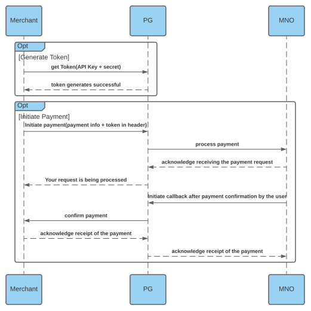

<h1 align="center">GO AZAM PAY</h1>

<p align="center">
<a href="https://github.com/Golang-Tanzania/GoAzam"></a>
<a href="https://github.com/Golang-Tanzania/GoAzam"></a>
<a href="https://pkg.go.dev/Golang-Tanzania/GoAzam"></a><br><br>
A golang wrapper for Azam Payment Gateway. Made with love for gophers ❤️.
</p>

## Introduction

[AzamPay](https://developerdocs.azampay.co.tz/redoc) is specialized in the development of end-to-end online payment management solutions for companies operating in East Africa. They provide an API which allows developers to integrate their system's to Azampay's gateway.

This is a Golang wrapper which significantly simplifies access and integration to Azampay's gateway.

<p align="center">

</p>

## Features of GoAzam

- Make mobile network checkouts
- Make bank checkouts 
- Manage callback URLs after a transaction is confirmed
- Return a list of registered partners of the provided merchant 
- Create post checkout URLs for payments


## Pre-Requisites

- Sign up for a developer account with [Azampay](https://developers.azampay.co.tz/)
- Register an app to get credentials
- Use the provided credentials to access the API. Save these credentials in a `config.json` file.

## Installation

Install the package with the `go get` command as shown below:
```sh 
go get github.com/Golang-Tanzania/GoAzam
```

Then import it as follows:
```go
package main 

import (
    "github.com/Golang-Tanzania/GoAzam"
)
```

## Authentication

- To get authenticated save your files in a `config.json` file as below:
```json
{
	"appName": "",
	"clientId": "",
	"clientSecret": "",
	"token": ""
}
```
- Initiliaza a variable of type `APICONTEXT`:
```go
var transactionTester GoAzam.APICONTEXT
```
- Load the keys with the `LoadKeys` method. This accepts the json file as a parameter and will return an error:
```go
if err := transactionTester.LoadKeys("config.json"); err != nil {
	fmt.Println(err)
	return
}
```
- The generate a session with the `GenerateSession` method that will get the `Bearer token` or return an error:
```go
if err := transactionTester.GenerateSession("sandbox"); err != nil {
    fmt.Println(err)
    return
}
```

## Transactions 

### MNO Checkout 
To perform an MNO Checkout, first create a variable of type `MNOPayload` and fill in its values. Then call the `MobileCheckout` with the `MNOPayload` as its parameter.

The `MobileCheckout` method will return a value of type `MNOResponse` and an error if any. Any desired value can be accessed with the returned value. Below is a full example:

```go
package main 
import (
	"Golang-Tanzania/GoAzam"
	"fmt"
)

func main() {

	// initialize
	var transactionTester GoAzam.APICONTEXT

	if err := transactionTester.LoadKeys("config.json"); err != nil {
		fmt.Println(err)
	}

	if err := transactionTester.GenerateSessionID("sandbox"); err != nil {
		fmt.Println(err)
		return
	}

	// example mobile checkout
	var exampleMobileCheckout GoAzam.MNOPayload

	exampleMobileCheckout.AccountNumber = "0700000000"
	exampleMobileCheckout.Amount = "2000"
	exampleMobileCheckout.Currency = "TZS"
	exampleMobileCheckout.ExternalID = "123"
	exampleMobileCheckout.Provider = "TIGO"

	mnoResult, err := transactionTester.MobileCheckout(exampleMobileCheckout)

	if err != nil {
		fmt.Println(err)
		return
	}

	fmt.Println(mnoResult.Success)
	fmt.Println(mnoResult.Message)
	fmt.Println(mnoResult.TransactionID)
}
```

### Bank Checkout
To perform an Bank Checkout, first create a variable of type `BankCheckoutPayload` and fill in its values. Then call the `BankCheckout` method with the `BankCheckoutPayload` as its parameter.

The `BankCheckout` method will return a value of type `BankCheckoutResponse` and an error if any. Any desired value can be accessed with the returned value. Below is a full example:
```go
package main 
import (
	"Golang-Tanzania/GoAzam"
	"fmt"
)

func main() {

	// initialize
	var transactionTester GoAzam.APICONTEXT

	if err := transactionTester.LoadKeys("config.json"); err != nil {
		fmt.Println(err)
	}

	if err := transactionTester.GenerateSessionID("sandbox"); err != nil {
		fmt.Println(err)
		return
	}
	// example bank checkout
	var exampleBankCheckout GoAzam.BankCheckoutPayload

	exampleBankCheckout.Amount = "10000"
	exampleBankCheckout.CurrencyCode = "TZS"
	exampleBankCheckout.MerchantAccountNumber = "123321"
	exampleBankCheckout.MerchantMobileNumber = "0700000000"
	exampleBankCheckout.MerchantName = "somebody"
	exampleBankCheckout.OTP = "1234"
	exampleBankCheckout.Provider = "CRDB"
	exampleBankCheckout.ReferenceID = "123"

	bankResult, err := transactionTester.BankCheckout(exampleBankCheckout)

	if err != nil {
		fmt.Println(err)
		return
	}

	fmt.Println(bankResult.Success)
	fmt.Println(bankResult.Message)
	fmt.Println(bankResult.Data.Properties.ReferenceID)
}
```

### Callback

The link for this endpoint will be provided by GoAzam upon registering your app. In the meantime, you could use the provided server code found in the `server` folder.

Initiliaza a variable of type `CallbackPayload` and fill in the necessary values. Then call the `Callback` method, providing the `CallbackPayload` and the absolute URL as parameters. The method will return a variable of type `CallbackResponse` or an `error`. Full example below:
```go
package main 
import (
	"Golang-Tanzania/GoAzam"
	"fmt"
)

func main() {

	// initialize
	var transactionTester GoAzam.APICONTEXT

	if err := transactionTester.LoadKeys("config.json"); err != nil {
		fmt.Println(err)
	}

	if err := transactionTester.GenerateSessionID("sandbox"); err != nil {
		fmt.Println(err)
		return
	}

	// example Callback
	var exampleCallback GoAzam.CallbackPayload

	exampleCallback.MSISDN = "0178334"
	exampleCallback.Amount = "2000"
	exampleCallback.Message = "testing callback"
	exampleCallback.UtilityRef = "1282-123"
	exampleCallback.Operator = "Airtel"
	exampleCallback.Reference = "123-123"
	exampleCallback.TransactionStatus = "success"
	exampleCallback.SubmerchantAcc = "01723113"

	// This domain should be the absolute path to your callback URL.
	// You can use the example server in this repository to test this endpoint.
	url := "http://localhost:8000/api/v1/Checkout/Callback"
	callbackResult, err := transactionTester.Callback(exampleCallback, url)

	if err != nil {
		fmt.Println(err)
		return
	}

	fmt.Println(callbackResult.Success)
}

```

### Payment Partners 

To get all available payment partners, call the `PaymentPartners` method as shown below. It will return a value of type `PaymentPatners` or an error:
```go
package main 
import (
	"Golang-Tanzania/GoAzam"
	"fmt"
)

func main() {

	// initialize
	var transactionTester GoAzam.APICONTEXT

	if err := transactionTester.LoadKeys("config.json"); err != nil {
		fmt.Println(err)
	}

	if err := transactionTester.GenerateSessionID("sandbox"); err != nil {
		fmt.Println(err)
		return
	}

	// example get Payment Partners

	examplePaymentPartners, err := transactionTester.PaymentPartners()

	if err != nil {
		fmt.Println(err)
		return
	}

	for _, paymentpartner := range examplePaymentPartners {
		fmt.Println(paymentpartner.PartnerName)
	}
}
```

### Post Checkout 

To get a post checkout URL, first initialize a variable of type `PostCheckoutPayload`. Then call the `PostCheckout` method providing the payload as a parameter. The method will return the checkout URL or an error. Full example below:

```go
package main 
import (
	"Golang-Tanzania/GoAzam"
	"fmt"
)

func main() {

	// initialize
	var transactionTester GoAzam.APICONTEXT

	if err := transactionTester.LoadKeys("config.json"); err != nil {
		fmt.Println(err)
	}

	if err := transactionTester.GenerateSessionID("sandbox"); err != nil {
		fmt.Println(err)
		return
	}

	// example Post checkout

	var examplePostCheckout GoAzam.PostCheckoutPayload

	examplePostCheckout.AppName = "example"
	examplePostCheckout.Amount = "10000"
	examplePostCheckout.ClientID = "1234"
	examplePostCheckout.Currency = "TZS"
	examplePostCheckout.ExternalID = "30characterslong"
	examplePostCheckout.Language = "SW"
	examplePostCheckout.RedirectFailURL = "yoururl"
	examplePostCheckout.RedirectSuccessURL = "yourrul"
	examplePostCheckout.RequestOrigin = "yourorigin"
	examplePostCheckout.VendorName = "VendorName"
	examplePostCheckout.VendorID = "e9b57fab-1850-44d4-8499-71fd15c845a0"

	postCheckoutURL, err := transactionTester.PostCheckout(examplePostCheckout)

	if err != nil {
		fmt.Println(err)
		return
	}

	fmt.Println(postCheckoutURL)
}

```

## Issues

If you notice any issues with the package kindly notify us as soon as possible.

## Credits

- [Avicenna](https://github.com/AvicennaJr)
- All other [contributors](https://github.com/Golang-Tanzania/GoAzam/graphs/contributors)
